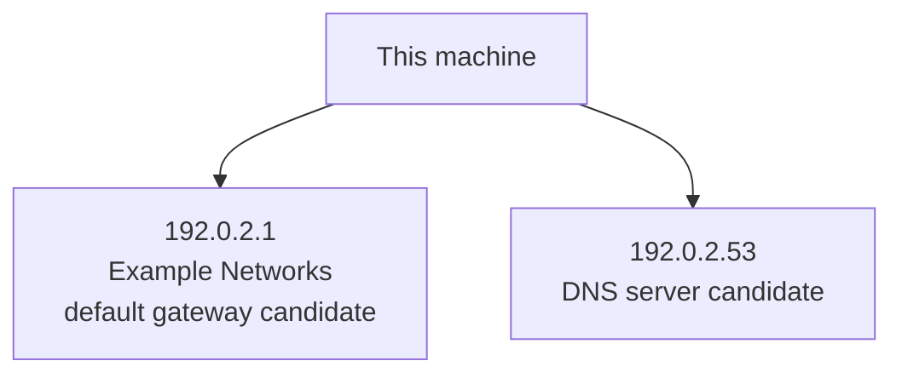

# Network Discovery Snapshot

Observed: 2026-05-01T00:00:00Z
Method: passive local OS snapshot

> This is an observational snapshot, not trusted household inventory. It may be incomplete, stale, or misleading. Review discoveries before turning them into Manual Inventory.

## Summary

- Interfaces observed: 1
- Routes observed: 1
- DNS servers observed: 1
- Neighbor entries observed: 2
- Core infrastructure candidates: 2
- Active scan hosts observed: 0

## Core Infrastructure Candidates

These are candidates only. Confirm role, location, owner, and Household Impact before adding them to Manual Inventory.

- **192.0.2.1**
  - Why listed: default gateway candidate, vendor-enriched observed neighbor
  - MAC: 00:00:5E:00:53:01
  - Vendor: Example Networks
  - Interfaces: eth0
  - Last-known neighbor state: REACHABLE
  - Confidence: candidate only; confirm manually
- **192.0.2.53**
  - Why listed: DNS server candidate
  - Confidence: candidate only; confirm manually

## Network Map

## Interfaces

- **eth0** — UP; 192.0.2.10/24

## Routes

- destination: default; gateway: 192.0.2.1; interface: eth0; preferred source: 192.0.2.10

## DNS Servers

- 192.0.2.53

## Observed Neighbors

- 192.0.2.1; MAC: 00:00:5E:00:53:01; vendor: Example Networks; interface: eth0; state: REACHABLE

## Ignored Network Noise

- Ignored multicast, broadcast, unspecified, loopback, and link-local neighbor entries: 1

## Unknowns and Limits

- Whether an observed neighbor is important to the household.
- Whether a vendor-enriched device has the role suggested by its vendor.
- Whether an observed host is currently healthy.
- Device roles, owners, locations, and household impact unless manually confirmed elsewhere.
- Services running on observed hosts. Passive discovery does not perform port scans.
- Devices that did not appear in local caches or the optional active scan.

## Evidence

- ip -j addr
- ip -j route
- ip -j neigh
- /etc/resolv.conf
